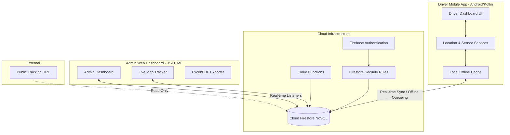
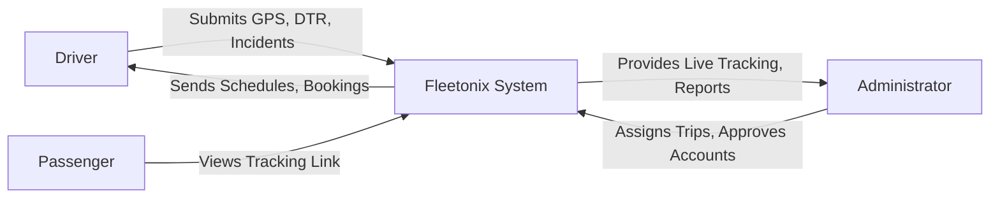
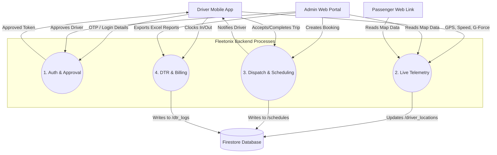
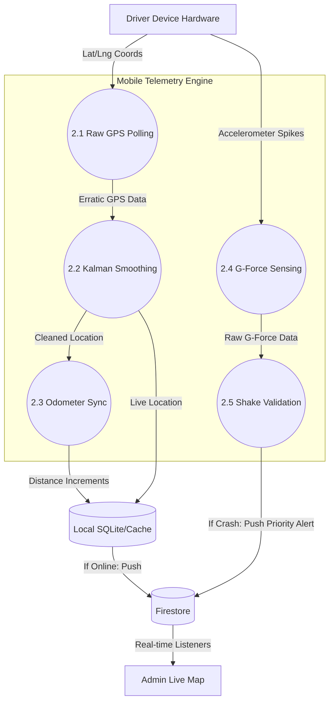
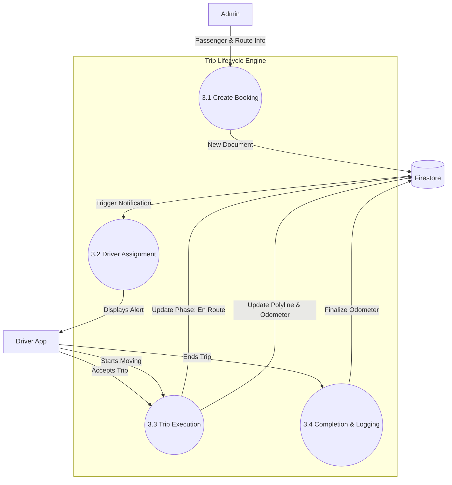
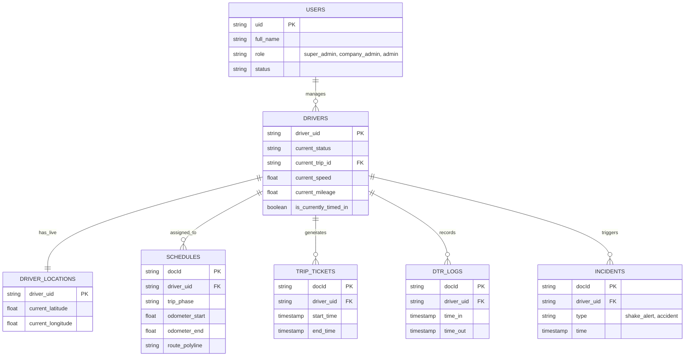
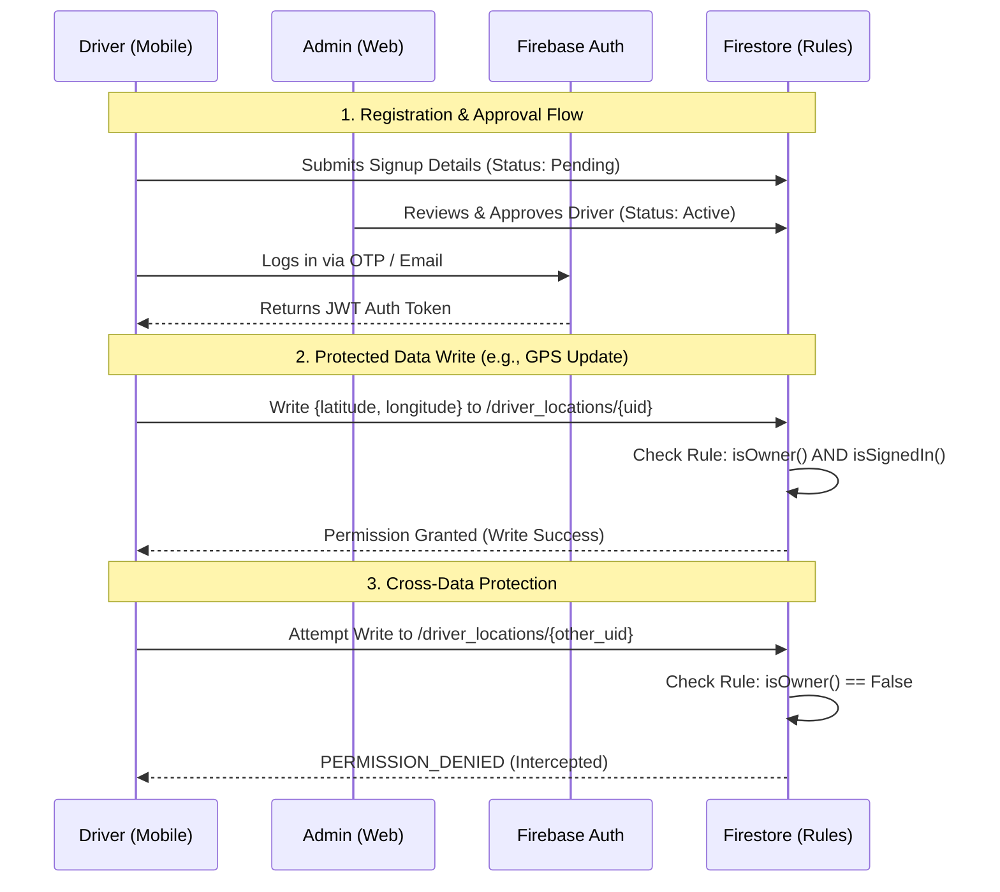

# Fleetonix System Technical Documentation

## 1. Executive Summary
Fleetonix is a comprehensive fleet management and driver tracking platform that bridges real-time telematic data from a mobile driver application to a centralized administrative web dashboard. Built on an offline-first, serverless architecture using Firebase, Fleetonix offers live GPS tracking, dynamic scheduling, automated daily time records (DTR), and emergency incident handling through intelligent sensor processing.

---

## 2. 📁 Project Structure Breakdown

The repository is modularized into distinct operational units:

```text
Fleetonix/
├── Fleetonix_Android_App/       # The Driver's Mobile Interface
│   └── app/src/main/java/.../fleetonix/
│       ├── DriverDashboard.kt   # Main UI and driver state management
│       ├── LocationService.kt   # Foreground service handling GPS and odometer sync
│       ├── TelematicsProcessor.kt # Smoothes erratic GPS data
│       ├── ShakeDetector.kt     # Hardware sensor listener for crash/accident detection
│       └── DataModels.kt        # Data structures for Firestore sync
├── web/                         # The Admin Web Dashboard
│   ├── admin/                   # Secure admin HTML views (dashboard, drivers, schedules)
│   ├── assets/js/               # Client-side logic for the web portal
│   │   ├── admin-dashboard.js   # Live map rendering and real-time state updates
│   │   ├── admin-bookings.js    # Dispatching and ride assignment logic
│   │   └── admin-dtr-monitoring.js # Attendance and reverse geocoding
│   └── ...                      # Public pages (login, tracking links, driver signup)
├── functions/                   # Firebase Cloud Functions (Backend compute)
│   └── audit_users.js           # Administrative tasks and auditing
├── firestore.rules              # Server-side database security policies and RBAC
└── firebase.json                # Firebase hosting and emulator configuration
```

---

## 3. ⚙️ Tech Stack Summary

- **Mobile Application (Driver Node):** Native Android (Kotlin), Google Maps SDK, Hardware Sensor API (Accelerometer).
- **Web Dashboard (Admin Node):** HTML5, CSS3, Vanilla JavaScript, Mapbox/Google Maps API for live tracking.
- **Backend & Database:** Firebase Authentication, Cloud Firestore (NoSQL), Cloud Storage, Cloud Functions.
- **Security:** Firebase Server-Side Security Rules (Role-Based Access Control).

---

## 4. 🧠 System Architecture Diagram



---

## 5. 🔄 Data Flow Diagrams (DFD)

### Level 0 DFD (Context Diagram)

This high-level context diagram illustrates the Fleetonix system as a single process, showing how external entities (Drivers, Administrators, and Passengers) interact with the system as a whole. It highlights the primary inputs (telemetry, actions) and outputs (reports, updates).



### Level 1 DFD (Core Processes)

This diagram breaks down the main system into its primary sub-systems (Authentication, Telemetry, Dispatch, and DTR). It maps the major data flows between the external entities, these core processes, and the central Firestore database, establishing a clearer view of internal routing.



### Level 2 DFD (Process 2.0: Live Telemetry & Safety)

This diagram breaks down the specific technical flow of how raw hardware data is processed into actionable fleet tracking and emergency alerts.



### Level 2 DFD (Process 3.0: Dispatch & Scheduling)

This details how trips are assigned and tracked through their entire lifecycle.



---

## 6. 🗄️ Database Schema (Entity Relationship Diagram)

The system relies on a heavily connected NoSQL document structure.



---

## 7. 🔐 Authentication & Authorization Flow

The system employs strict **Server-Side Security Rules** using `firestore.rules`. Authorization is evaluated dynamically at the database layer before any read/write operation is executed.



**Key Security Principles Implemented:**
- **`isAdmin()` Check:** Validators verify if the requesting user's UID corresponds to a document in the `users` collection with a valid admin role.
- **`isAuthorizedDriver()` Check:** Allows drivers to only modify documents assigned to them via `driver_uid` or `driver_email`.

---

## 8. 🧩 Module Breakdown & Explanations

1. **Live GPS & Telemetry Engine (`LocationService.kt`, `TelematicsProcessor.kt`)**
   - Runs as an Android Foreground Service, ensuring tracking persists even when the screen is off.
   - Applies a Kalman-inspired smoothing algorithm to filter out GPS noise and prevent erratic location jumps.
2. **Offline-First Synchronization (Firebase Persistence)**
   - If the driver enters a dead zone (e.g., a tunnel), DTR logs and trip milestones are cached locally. Once connectivity is restored, the queue is pushed to Firestore automatically.
3. **Hardware Shake Detection (`ShakeDetector.kt`)**
   - Listens to device accelerometer spikes. If a high G-force event is detected (indicative of a crash), an immediate "Priority 0" alert is dispatched to the admin dashboard.
4. **Real-time Odometer Sync (`LocationService.kt`)**
   - Calculates distance incrementally on the device and updates the `current_mileage` in Firestore, rendering manual odometer tampering impossible.
5. **Admin Dispatch & Live Mapping (`admin-dashboard.js`, `admin-bookings.js`)**
   - Admins can view driver statuses in real-time. Assigning a booking instantly propagates to the driver's assignment queue without needing a manual refresh.

---

## 9. 📌 Key Features

- **Real-Time Visibility:** 5-second interval GPS map updates for dispatchers.
- **Automated DTR:** Geofenced and timestamped attendance tracking.
- **Passenger Tracking Links:** Shareable URLs for external users to monitor driver ETA.
- **Emergency Management:** Automated crash detection via mobile hardware sensors.
- **Audit Trails & Exporting:** 1-click Excel downloading for trip histories and DTR.
- **Unbreakable Validation:** Database rules prevent data spoofing, cross-driver access, and unauthorized deletion.

---

## 10. 🧪 Suggested Improvements

1. **Scalability (Database Indexing)**
   - *Current State:* As historical `trip_tickets` and `dtr_logs` grow, large read operations may degrade dashboard load times.
   - *Solution:* Implement automated data archiving via Cloud Functions (moving data older than 6 months to Cold Storage/BigQuery) and utilize pagination cursors in the admin UI.
2. **Security (Token Revocation)**
   - *Current State:* Deactivated drivers may retain session access until their JWT token expires (up to 1 hour).
   - *Solution:* Implement Firebase Custom Claims and a token revocation check in Cloud Functions upon driver termination to force immediate logout.
3. **Structure (State Management)**
   - *Current State:* The Android app utilizes basic ViewModels and the Web app relies heavily on DOM manipulation with Vanilla JS.
   - *Solution:* Refactor the Web dashboard to use a reactive framework (React/Vue) or a global state manager to reduce complex DOM event listener chains. Update Android to utilize modern Jetpack Compose for UI.
4. **Resilience (Battery Optimization)**
   - *Current State:* The foreground service runs constant location updates, which drains battery life.
   - *Solution:* Implement dynamic geofencing and motion detection algorithms that pause high-frequency GPS polling when the device is completely stationary.
