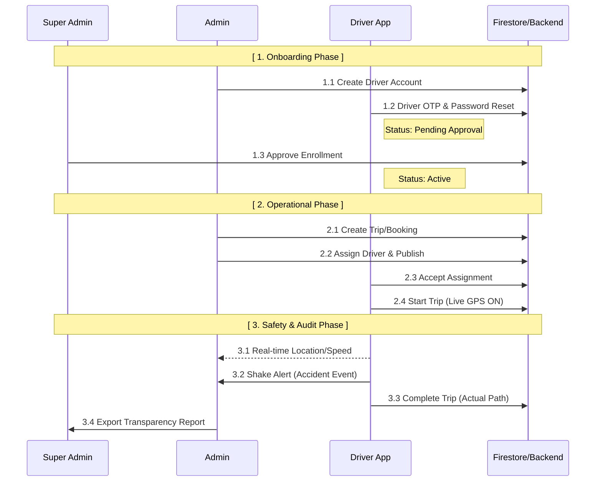
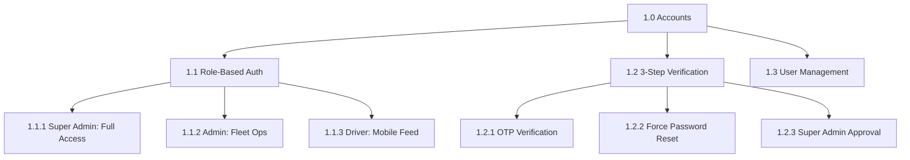
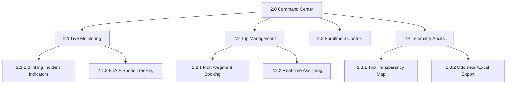
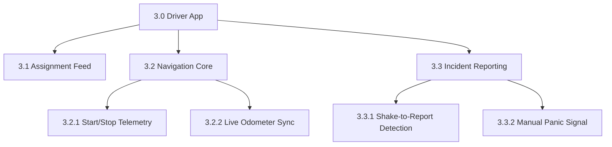

# Project Structure & Functional Architecture - Fleetonix

**Fleetonix** is an advanced fleet management and real-time tracking system strictly operating with three distinct roles: **Super Admin**, **Admin**, and **Driver**. The system focuses on absolute transparency via 1:1 GPS telemetry matching and high-security driver onboarding.

---

## System Process Flow
This diagram illustrates the operational lifecycle of the system, from account creation to the final auditing of a trip.

---

## 1.0 Accounts & Access Module
Responsible for the secure multi-stage onboarding process required for all personnel.

---

## 2.0 Command Center (Admin/Super Admin)
The web-based nerve center for monitoring the entire fleet and managing logistics.

---

## 3.0 Driver Application Module
The high-frequency telemetry source used by drivers to manage assignments and safety.

---

## Project Capabilities and Limitations

### A. COMMAND CENTER (Capabilities)
1. **Dynamic Fleet Control**: Real-time management of driver shifts, assignments, and work hours with immediate publish capabilities.
2. **"God-View" Monitoring**: High-frequency map updates showing every driver's precise position, speed, and heading.
3. **High-Security Onboarding**: Mandatory OTP and Password Reset for all users, followed by a hard-block until a Super Admin approves the account.
4. **Automated Incident Response**: Real-time listening for accident events (Shake Detection) with intrusive visual alerts in the command center.
5. **Absolute Trip Transparency**: A specialized map feature that renders the **exact path** traveled by the driver, mathematical proof of trip completion without relying on signatures.
6. **Unified Reporting**: Exporting historical DTR and Trip Ticket data to formatted Excel files for official documentation.

### B. LIMITATIONS
1. **Telemetry Continuity**: GPS tracking and live map updates require persistent cellular data (LTE/5G).
2. **Sensor Calibration**: Automatic accident detection requires a functional accelerometer on the driver's mobile device.
3. **Geolocation Drift**: In extremely dense urban areas, path rendering may show minor deviations (urban canyons).
